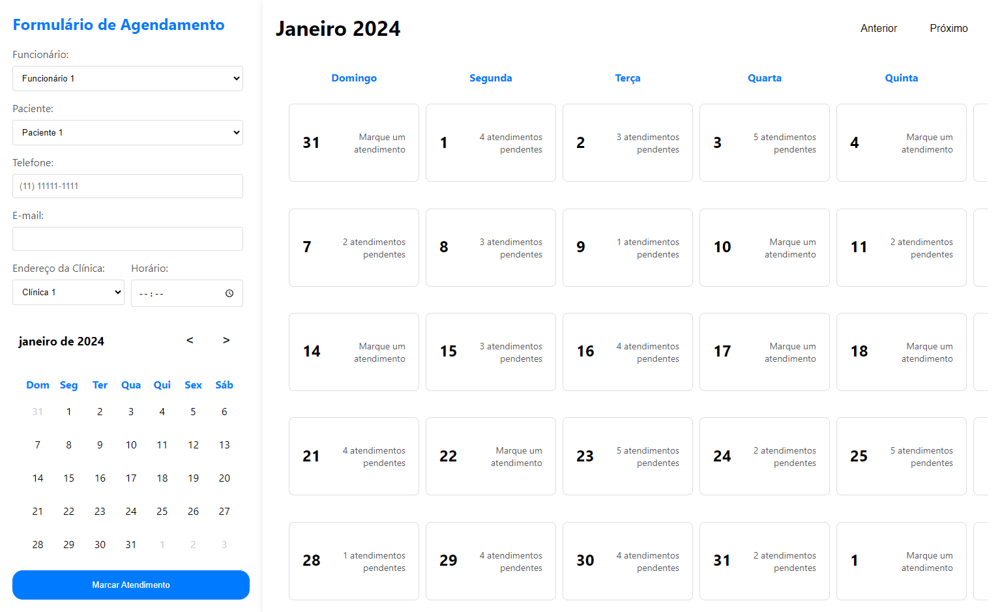

# Página de Calendário

Este repositório contém a implementação de uma página de calendário, acompanhada por uma imagem representativa exibida na pasta "photos" com o nome de arquivo "page.png".

## Descrição da Página de Calendário

A página de calendário foi desenvolvida para proporcionar uma experiência organizada e visualmente agradável para o usuário. O layout inclui recursos intuitivos que facilitam a visualização de datas, eventos e compromissos. Além disso, a disposição limpa e moderna visa proporcionar uma experiência de usuário agradável e eficiente.

## Foto da Página

A imagem representativa da página de calendário pode ser encontrada no arquivo "page.png" dentro da pasta "photos". Esta imagem oferece uma prévia visual da aparência da página e pode ser útil para uma rápida visualização do projeto.

### Prototipo usado para criar a tela de calendario de consutas no sistema que esta sendo desenvolvido para o Saas no setor de saude